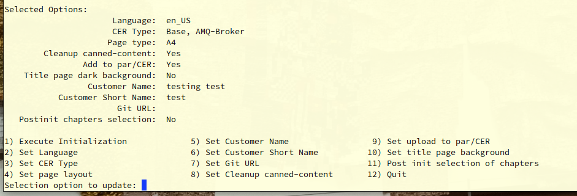

# clean-cer-contents.sh

This script is used in the init-cer script. However, it can be run after initialization, and as many times as you like. Please do so, and report any issues you find.

## Base usage

When running init-cer, select option 11 (current version).

Once you select it, the init will complete like it has always done, but goes into this model:

For each of the sections in the document (the files that are in `include` statements`) it shows you what it does and if you want, you can ask for more details:

Once you have run through all sections, the original README.adoc is saved, and the new version is ready to be used.  
You can always find the original file back, meaning you will always be able to fetch the contents you have removed.

## Advanced usage

You can run the script separately from the toplevel directory: `./scripts/clean-cer-contents.sh README.adoc`  
This will give another chance to select the content to include. 

You can also copy the `README.adoc.original` back to `README.adoc` and run the script again, this file has all the numbers of the `include` files too.

MtH - Added December 1st 2023, who needs a weekend anyways?

